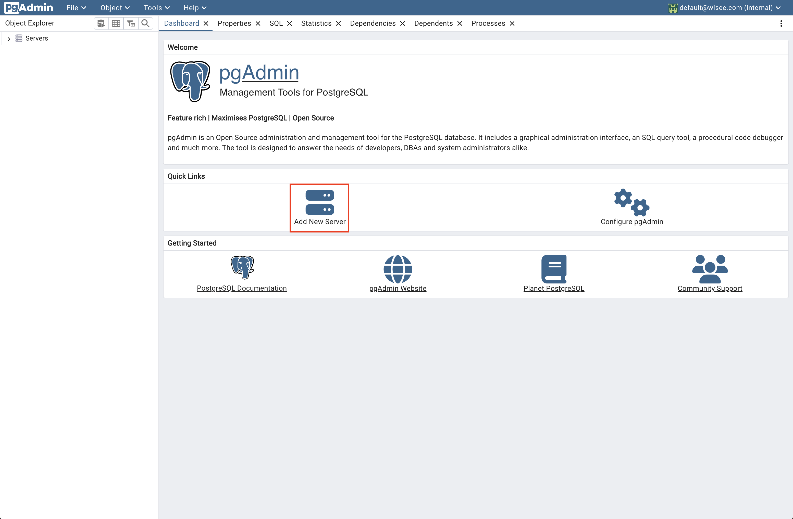
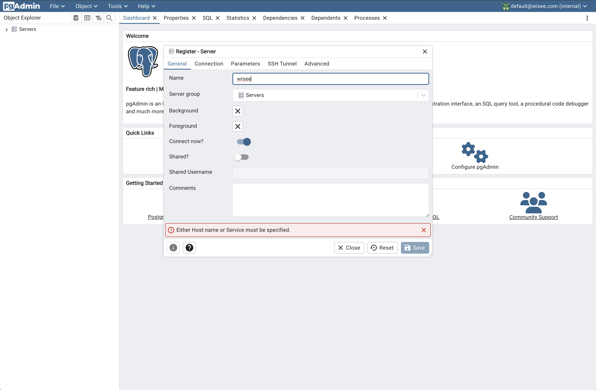
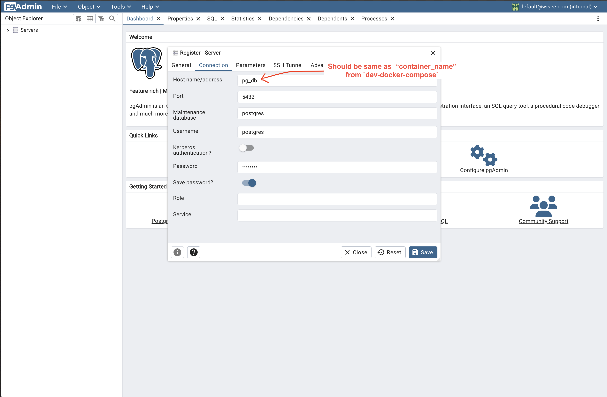
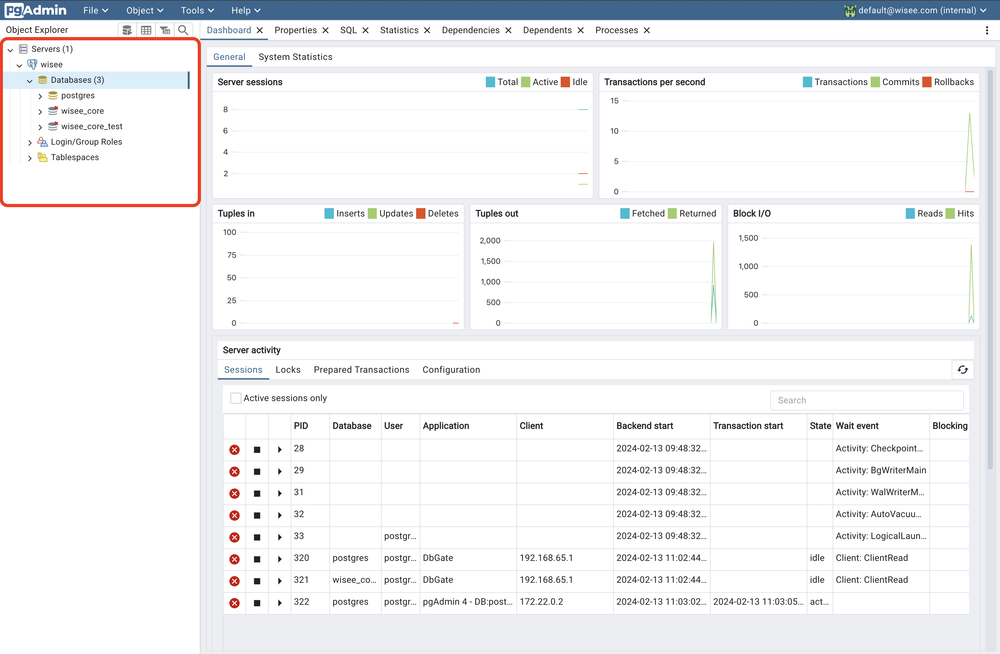

# wisee backend

## Setup

To setup this project, you need to install the following tools:

-   [Go - 1.21.0](https://go.dev/dl/)
-   [Air](https://github.com/cosmtrek/air)
-   [Golang Migrate - CLI](https://github.com/golang-migrate/migrate/tree/master/cmd/migrate)
-   [Docker](https://www.docker.com/get-started/)

#### Windows

> Skip this step if you are running the project in a Unix based system or have `make` already installed.

We use the `make` command to run different scripts in the project. Install `make` command from [here](https://gnuwin32.sourceforge.net/packages/make.htm)

### Development Setup

1. Once you have installed the above tools, clone the repository and navigate to the project folder.

2. To setup the project, run the following command:

```bash
make setup
```

3. If the above command runs successfully, you can start the development server by running the following command:

```bash
make watch
```

To check if the server is running, navigate to `http://localhost:8080/health-check` in your browser.

### Creating a production build

To create a production build, run the following command:

```bash
make build
```

This will create a executable file in the `bin` folder.

### Migrations

Migrations are handled using [golang-migrate](https://github.com/golang-migrate/migrate), read the [docs](https://github.com/golang-migrate/migrate/blob/master/database/postgres/TUTORIAL.md) for more information on working with migrations.

## Database

### Connecting to the database

1. Visit `http://localhost:54321` in your browser and login with the following credentials:

    - Email : `default@wisee.com`
    - Password : `default`

2. If you do have server created already, create a new server by clicking on the `Add New Server` button.
   

3. Enter the server name
   

4. Enter the connection details

    - Hostname/Address : `pg_db`
    - Port : `5432`
    - Username : `postgres`
    - Password : `postgres`

    

5. Click on the `Save` button. You should now be able to see the server and associated databases in the left sidebar.
   
